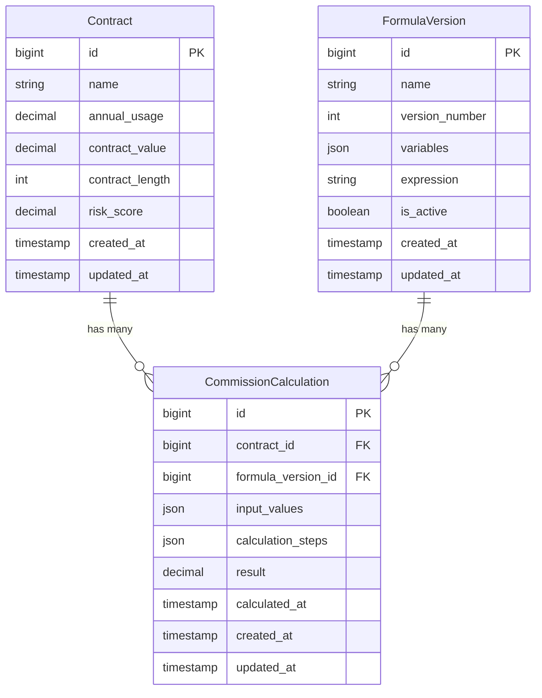

# Architecture Notes & Documentation

This document outlines the architectural decisions, system design, and technical philosophy behind the EnergyLogix Dynamic Commission Engine.

---

## 1. Backend Architecture (Laravel)

The backend is built as a headless REST API using Laravel 11. I adhere strictly to SOLID principles, heavily decoupling business logic from the HTTP layer.

### Controllers & The HTTP Layer
Controllers are kept extremely thin. They are solely responsible for:
1. Receiving the HTTP Request.
2. Validating the payload using strict **FormRequest** classes (e.g., `StoreFormulaVersionRequest`).
3. Passing the validated DTOs or primitive data to an Action or Service class.
4. Returning a standardized **JsonResource** (e.g., `ContractResource`).

### Data Transfer Objects (DTOs)
I utilized Data Transfer Objects (`CommissionCalculationData`, `SimulationResult`) to strongly type data payloads passing between the calculation services and the controllers. This prevents array-shape ambiguity (so-called "array blindness") and ensures that my calculations have predictable, type-safe outputs.

### Actions & Services
Business logic is encapsulated in single-responsibility Action classes and Service classes.
- **Actions** (e.g., `ActivateFormulaVersionAction`, `CalculateContractCommissionAction`): Handle orchestrated tasks that involve database transactions, event dispatching, or modifying models.
- **Services** (e.g., `FormulaValidator`, `FormulaEvaluator`, `CommissionSimulator`): Pure computational classes that handle complex logic, mathematics, or graph algorithms.

### Events & Background Queues
When a new Formula Version is activated, it triggers the `FormulaVersionActivated` event. A dedicated listener (`RecalculateCommissionsListener`) catches this event and dispatches a `CalculateCommission` Job to the queue for *every* contract. 
- **Why?** This ensures the HTTP request returns instantly, even if there are millions of contracts that need their commissions recalculated. The heavy lifting happens asynchronously in the background.
- Similarly, when a formula version is deactivated, a `FormulaVersionDeactivated` event is fired. A listener dispatches a `GenerateClosingReport` job which stream-writes a CSV report of all historical calculations for that version in a memory-efficient manner using `spatie/simple-excel`.

---

## 2. The Core Commission Engine

The calculation engine is the most complex part of the application. It is broken down into three distinct phases: Parsing, Resolving, and Evaluating.

### A. Mathematical Parsing
Instead of writing a fragile custom regex or relying on dangerous `eval()` blocks, formulas are parsed using **Symfony's `ExpressionLanguage`**. This natively and securely handles mathematical operator precedence, nested parentheses, exponentiation, and floats.

### B. Cyclic Dependency Detection (Kahn's Algorithm)
To prevent infinite loops during calculation, the `DependencyResolver` ensures variables do not reference each other cyclically. It does this using **Topological Sorting** via Kahn's algorithm:
1. It extracts all dependencies for each intermediate step.
2. It builds a directed graph where nodes are variables and edges are dependencies.
3. It calculates the in-degree of all nodes and attempts a topological sort. 
4. If the sort fails (i.e., a node cannot be ordered), a cycle is detected and a `CircularDependencyException` is thrown.
5. If successful, it guarantees that dependent variables are calculated in the exact order required.

### C. Simulation vs Execution
- **`CommissionSimulator`**: Uses a `calculateDryRun` method that evaluates the math entirely in-memory across a loop of all contracts. It aggregates the totals and returns them, bypassing the database entirely to ensure existing records are never accidentally modified.
- **`CommissionCalculator`**: Executes the math and returns the step-by-step breakdown as a DTO. The `CalculateContractCommissionAction` then saves this explicitly to the database for the audit trail.

---

## 3. Database Schema

I utilize **MySQL 8.0** for relational data integrity.

### JSON Columns
Notice the use of `json` columns for `variables`, `input_values`, and `calculation_steps`. Because formula definitions and calculation breakdowns are highly dynamic and specific to the exact moment they were calculated, storing them as JSON arrays allows us to retain a perfect, immutable audit trail without needing rigid pivot tables.

---

## 4. Frontend Architecture (Vue 3)

The frontend is built as a Single Page Application (SPA) using **Vue 3** and **Vite**.

### State Management
I utilize **TanStack Query (Vue Query)** for all remote state management and data fetching. 
- **Why?** It automatically handles caching, background-refreshing, and loading states. When a mutation occurs (like activating a formula), I simply invalidate the `formulas` and `contracts` query keys, and Vue Query instantly re-fetches the fresh data, ensuring the UI is always perfectly synced with the backend without complex Vuex/Pinia stores.

### Component Structure
- Components are modularized strictly into `pages/` (full route views) and `components/` (reusable UI elements like Modals, Tables, and Badges).
- Styling is handled exclusively with **Tailwind CSS**, adhering to a utility-first methodology to ensure a highly responsive, flat, and modern aesthetic.

---

## 5. Testing & Static Analysis

I enforce rigorous quality control on the codebase:
- **Pest PHP**: The entire backend is covered by ~61 Pest feature and unit tests (over 150 strict assertions), specifically targeting graph cyclic dependencies, mathematical edge cases, and API responses.
- **PHPStan (Level 5)**: Static analysis ensures strict type safety across the entire codebase, heavily utilizing PHPDoc blocks (`@var`, `@property`) to guarantee array shapes and object structures are never ambiguous.
- **Laravel Pint**: Enforces strict, consistent PSR-12 code formatting.

## 6. Assumptions Made During Implementation

1. **Immutable Audit Trails**: I assumed that once a commission is calculated, the record of that calculation (and the specific steps used) should never be altered, even if the base formula changes in the future. This is why I store the exact `input_values` and `calculation_steps` as JSON snapshots on the `CommissionCalculation` model.
2. **Asynchronous Recalculations**: I assumed that activating a new formula on a production database with potentially millions of contracts would cause an HTTP timeout if processed synchronously. Therefore, I offloaded the mass-recalculation to the background Queue.
3. **Variable Naming Strictness**: I assumed that formula variables should be strictly validated for existence before evaluation to prevent silent mathematical failures. If an admin uses an undefined variable, the `FormulaValidator` blocks the save.
4. **Data Types**: I assumed all monetary and usage values (`annual_usage`, `contract_value`, `result`) should be treated as precise decimals/floats in the calculation engine.
