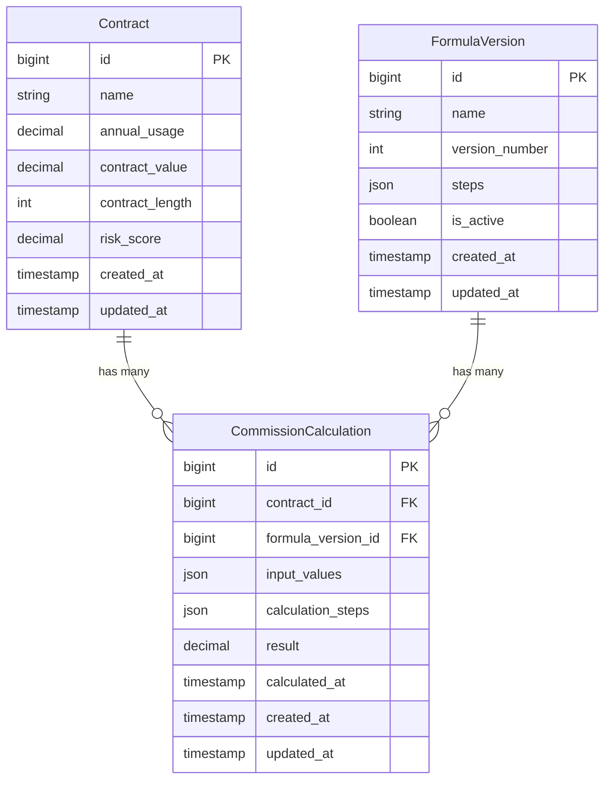

# Architecture Notes & Documentation

This document outlines the architectural decisions, database schema, and design philosophy behind the EnergyLogix Dynamic Commission Engine.

## 1. Architectural Decisions

### Data Transfer Objects (DTOs)
We used Data Transfer Objects (e.g., `FormulaVersionData`, `CommissionCalculationData`) to strictly type data payloads passing between the controller layer and the service/action layer. This prevents array-shape ambiguity and ensures our calculations and validation logic have predictable, type-safe inputs.

### Actions & Services
Business logic is decoupled from controllers using single-responsibility Action classes (`CreateFormulaVersionAction`, `CalculateContractCommissionAction`) and Service classes (`FormulaValidator`, `FormulaEvaluator`, `CommissionSimulator`).
- **FormulaValidator**: Handles cyclic dependency detection using a topological sort (Kahn's algorithm).
- **FormulaEvaluator**: Responsible for safely evaluating string-based mathematical expressions and variable substitutions.
- **CommissionSimulator**: Simulates formula impact in memory without persisting data.

### Events & Queues
When a new Formula Version is activated, it triggers the `FormulaVersionActivated` event. The `RecalculateCommissionsListener` listens to this event and dispatches a `CalculateCommission` Job to the queue for every contract. This ensures the HTTP request returns quickly even if there are millions of contracts to recalculate.

### API Resource Layer
The API layer relies heavily on Laravel `JsonResource` classes to consistently wrap and format responses, preventing internal database structure or hidden fields from leaking to the frontend.

## 2. Database Schema

## 3. Algorithm: Cyclic Dependency Detection
To prevent infinite loops during calculation, the `FormulaValidator` ensures variables do not reference each other cyclically. It does this by:
1. Extracting all dependencies for each step via Regex.
2. Building a directed graph where nodes are variables and edges are dependencies.
3. Attempting a topological sort. If the sort fails (i.e., not all nodes can be ordered), a cycle is detected and an exception is thrown.

## 4. Frontend Architecture
The Vue frontend utilizes **TanStack Query (Vue Query)** for remote state management. This ensures data is cached, background-refreshed, and automatically invalidated across the application when mutations occur (e.g., activating a new formula automatically invalidates the formula list and contract data caches).

Components are built using Headless UI concepts and styled with Tailwind CSS, strictly isolating presentation from the data fetching hooks (composables).
